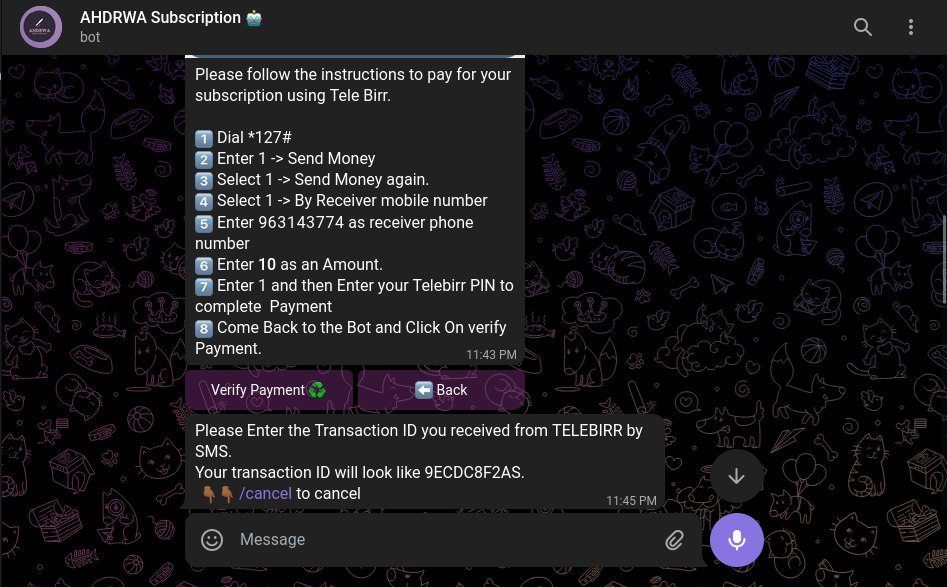
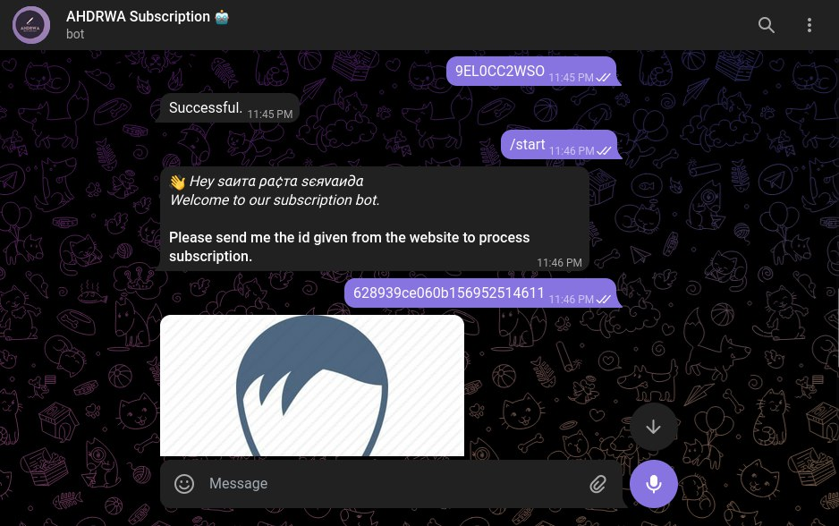

# ⚡ Introduction ⚡

፻፲፫ is project developed in May 20 -22, 2022 by CESC ASTU Development Division members as Hackthon based on [Machine learning app](https://github.com/mukerem/AmharicHandwrittenDigitRecognitionMobileApp/tree/master) made by [Mukerem Ali]()

# ⚡ Components ⚡

- [Backend](https://github.com/Besufikad17/AHDRWA-backend)
- [Bot](https://github.com/binitech/ahdrwa-bot)
- [Docs](https://stupendous-meringue-4b95b0.netlify.app/)

# Demo

# Devs

[Besufikad Micheal](https://github.com/Besufikad17)

[Mikiyas Godana](https://github.com/mikigode)

[Tamirat Ayalew](https://github.com/binitech)
